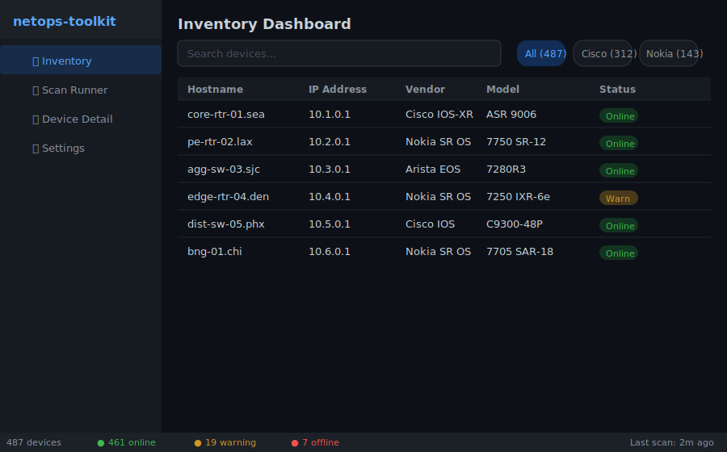
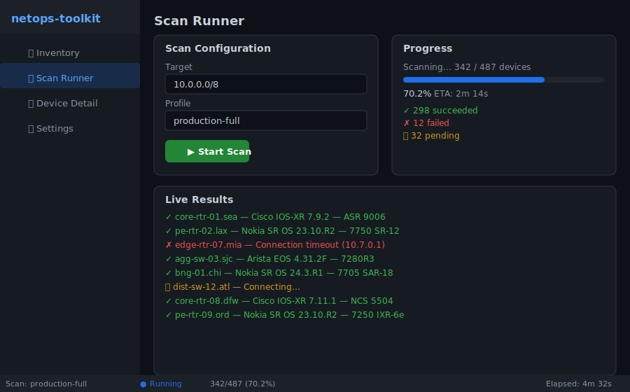
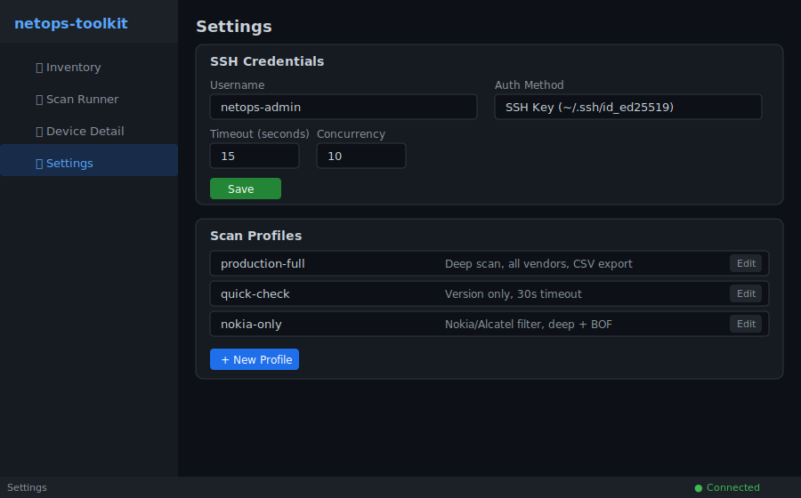

# netops-toolkit-app

Network operations TUI/GUI built with **Svelte 5 + Tauri 2 + design-dojo**.

Desktop and terminal interface for [netops-toolkit](https://github.com/plures/netops-toolkit).

## Screenshots

### Inventory Dashboard
Filter, sort, and search across all discovered devices. Vendor breakdown badges and real-time status indicators.



### Scan Runner
Launch network scans with live progress tracking, per-device results streaming, and ETA estimation.



### Settings
Configure SSH credentials, authentication methods, timeouts, and reusable scan profiles.



## Modes

```bash
# Desktop GUI (full Svelte UI in Tauri webview)
netops-toolkit-app

# Terminal TUI (same app, rendered in terminal via svelte-ratatui-adapter)
netops-toolkit-app --tui terminal
# or alias:
netops-toolkit-tui
```

## Architecture

```
┌─────────────────────────────────────────────────────┐
│ Tauri 2 Process                                     │
│                                                     │
│  Svelte 5 App (design-dojo components)              │
│  ├── Praxis (logic engine)                          │
│  ├── PluresDB (local-first data)                    │
│  ├── Chronos (state chronicle)                      │
│  └── netops-toolkit Python backend (Tauri sidecar)  │
│                                                     │
│  Rendering:                                         │
│  ├── GUI mode → Tauri webview (default)             │
│  └── TUI mode → svelte-ratatui-adapter → terminal   │
└─────────────────────────────────────────────────────┘
```

## Views

- **Inventory Dashboard** — device table with filtering, sorting, vendor breakdown
- **Scan Runner** — launch scans, progress tracking, live results
- **Device Detail** — version, serial, interfaces, neighbors, health
- **Settings** — credentials, SSH config, scan profiles

## Stack

- [Svelte 5](https://svelte.dev) — UI framework
- [Tauri 2](https://tauri.app) — cross-platform runtime
- [design-dojo](https://github.com/plures/design-dojo) — component library (dual GUI/TUI mode)
- [netops-toolkit](https://github.com/plures/netops-toolkit) — Python backend for network scanning
- [svelte-ratatui](https://github.com/plures/svelte-ratatui) — TUI adapter

## Development

```bash
npm install
npm run dev          # Svelte dev server
npm run tauri:dev    # Tauri + Svelte
```

## License

AGPL-3.0
