# netops-toolkit-app

Network operations TUI/GUI built with **Svelte 5 + Tauri 2 + design-dojo**.

Desktop and terminal interface for [netops-toolkit](https://github.com/plures/netops-toolkit).

## Modes

```bash
# Desktop GUI (full Svelte UI in Tauri webview)
netops-toolkit-app

# Terminal TUI (same app, rendered in terminal via svelte-ratatui-adapter)
netops-toolkit-app --tui terminal
# or alias:
netops-toolkit-tui
```

---

## Screenshots

### GUI Mode

> Desktop application with full graphical interface — dark Tokyo Night theme, responsive sidebar navigation.

#### Dashboard
Fleet overview at a glance: device counts by health status, vendor breakdown charts, recent alerts, top resource consumers, and quick action buttons.

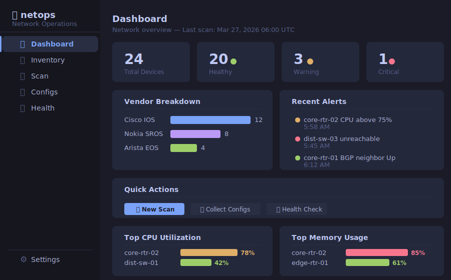

#### Inventory
Filterable device table with vendor badges, search, and per-column sorting. Click any row to drill into device detail.

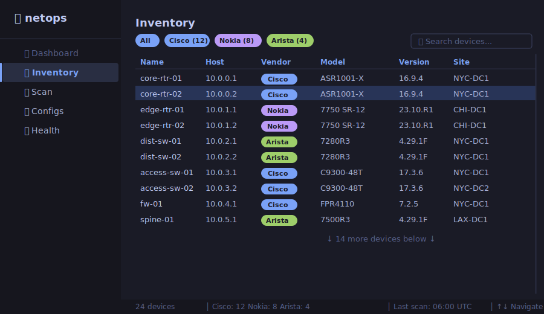

#### Scan Runner
Configure and launch network discovery scans. Live progress bar with device count, elapsed time, ETA, and streaming results table. Vendor summary updates in real-time as devices are discovered.

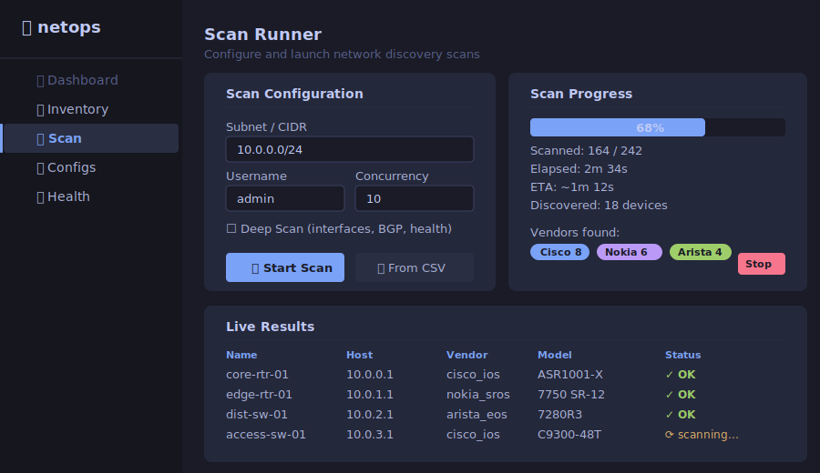

#### Device Detail
Deep dive into individual devices. Tabbed interface for interfaces (with error highlighting), health metrics with CPU/memory bars, BGP peers, and running config. Interface error recommendations shown inline.

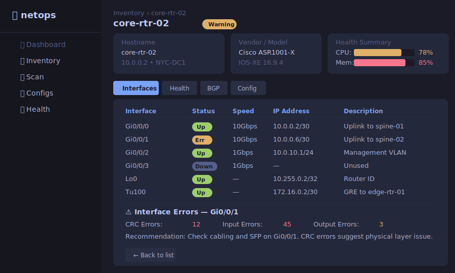

#### Config Management & Diff
Split-pane config browser: version history on the left, unified diff viewer on the right. Color-coded additions/deletions with section headers. Rollback to any previous version.

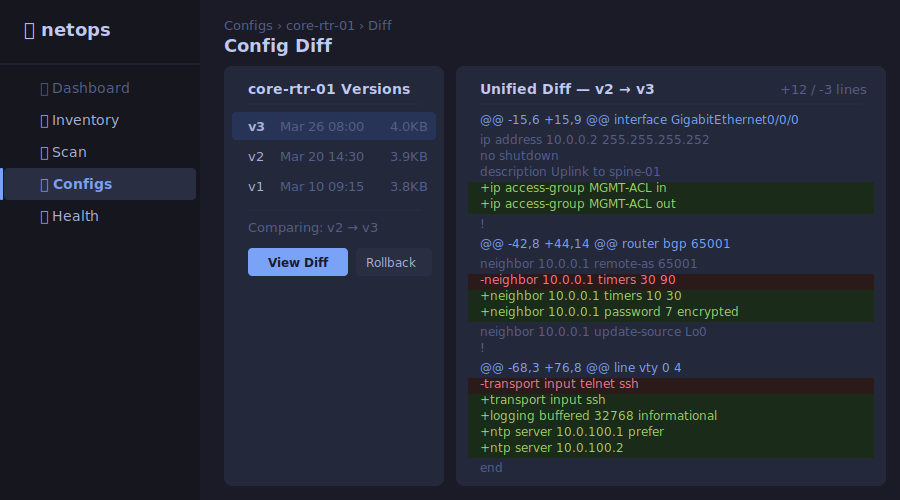

#### Fleet Health
Real-time fleet monitoring: summary cards (healthy/warning/critical), top CPU and memory consumers with progress bars, interface error table, and chronological log alerts with severity coloring.

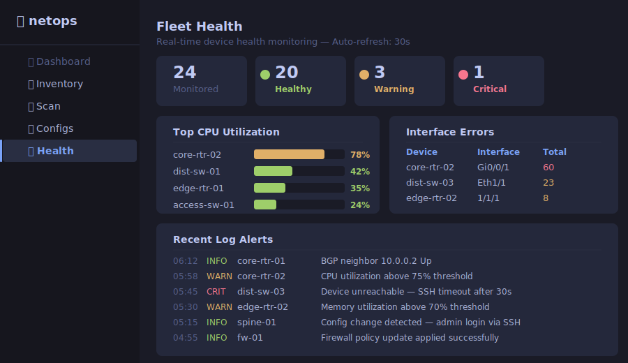

#### Credential Vault
Encrypted credential store with scope-based resolution (device → group → default). Master password lock/unlock, add/edit/delete credentials, auth method selection (password/SSH key), enable secret support, and live resolution preview showing which credential matches a given hostname.

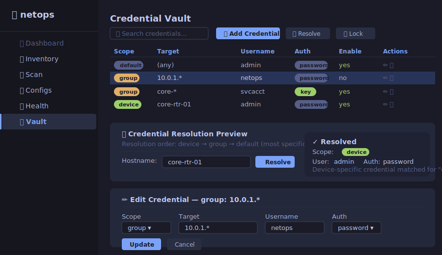

#### Settings
SSH credentials, scan defaults (concurrency, timeout, deep scan), appearance (theme, status bar), and data management (export/import). All changes persisted locally.


---

### TUI Mode

> The same Svelte app rendered in your terminal via `svelte-ratatui-adapter`. Box-drawing tables, keyboard navigation, status bar — zero GUI dependencies. Works over SSH.

#### Dashboard
Fleet status summary with ASCII bar charts for vendor breakdown, recent alerts with severity indicators, and top CPU/memory utilization side by side. Keyboard shortcuts for quick navigation.

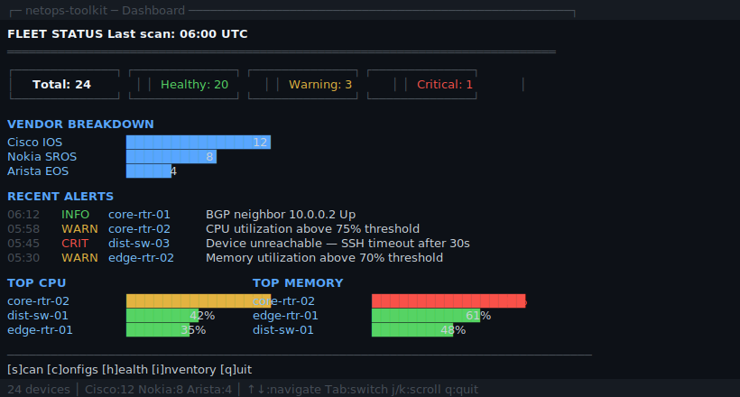

#### Inventory
Box-drawing table with vendor badges, row selection, and search. Same data as GUI mode, keyboard-driven navigation. Status bar shows device counts and key bindings.

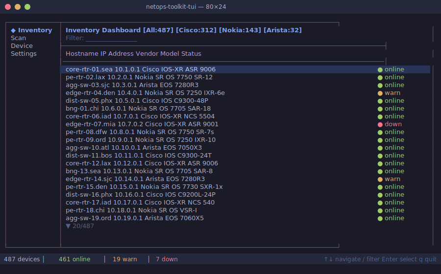

#### Scan Runner
Live scan progress with ASCII progress bar, vendor discovery counters, and streaming results table. Ctrl+C to stop scan cleanly.

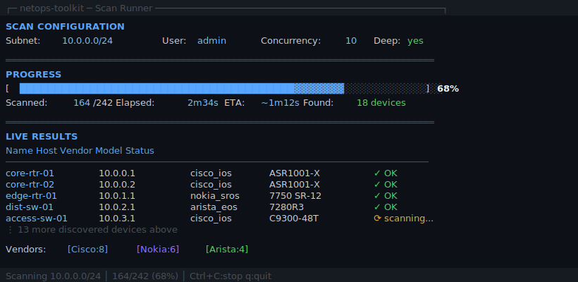

#### Config Diff
Split-pane in terminal: version list on left, unified diff on right with green/red line coloring. Vim-style navigation (j/k scroll). Rollback support.

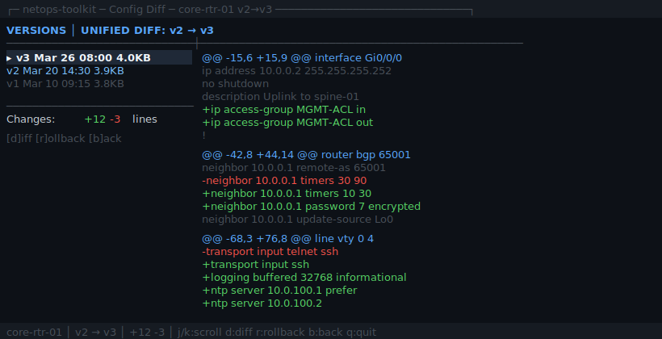

#### Fleet Health
Device health table with color-coded status, CPU/memory/temperature columns. Interface errors and recent log alerts below. Auto-refresh toggle for monitoring.

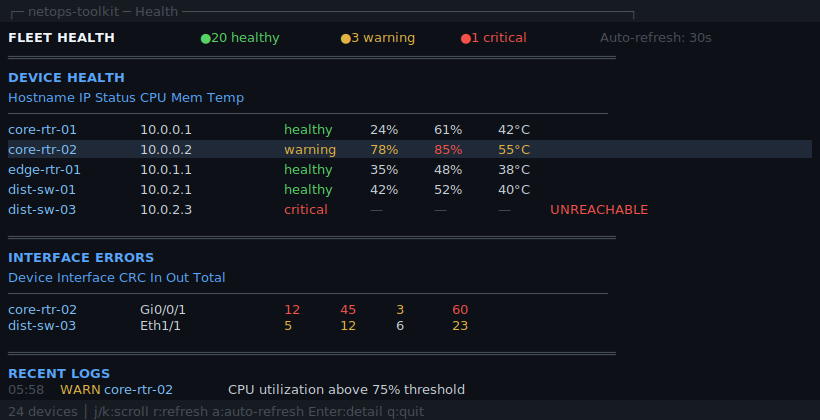

#### Credential Vault
Credential table with scope badges, resolution preview with hierarchy chain display. Keyboard-driven add/edit/delete/lock. Shows full resolution chain (device → group → default) for any hostname.

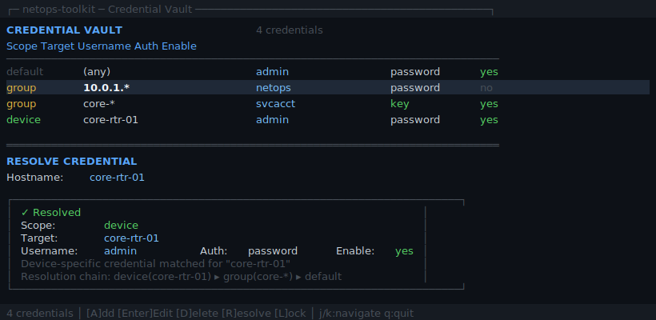

---

## Architecture

```
┌─────────────────────────────────────────────────────┐
│ Tauri 2 Process                                     │
│                                                     │
│  Svelte 5 App (design-dojo components)              │
│  ├── Praxis (logic engine)                          │
│  ├── PluresDB (local-first data)                    │
│  ├── Chronos (state chronicle)                      │
│  └── netops-toolkit Python backend (Tauri sidecar)  │
│                                                     │
│  Rendering:                                         │
│  ├── GUI mode → Tauri webview (default)             │
│  └── TUI mode → svelte-ratatui-adapter → terminal   │
└─────────────────────────────────────────────────────┘
```

## Views

| View | Description | GUI | TUI |
|---|---|---|---|
| **Dashboard** | Fleet overview, vendor breakdown, alerts, quick actions | ✅ | ✅ |
| **Inventory** | Device table with filtering, sorting, vendor badges | ✅ | ✅ |
| **Scan Runner** | Launch scans, live progress, streaming results | ✅ | ✅ |
| **Device Detail** | Interfaces, health, BGP peers, running config (tabbed) | ✅ | ✅ |
| **Config Browser** | Version history, content viewer | ✅ | ✅ |
| **Config Diff** | Unified diff with rollback support | ✅ | ✅ |
| **Fleet Health** | CPU/memory/temp monitoring, interface errors, log alerts | ✅ | ✅ |
| **Credential Vault** | Encrypted credential store, scope-based resolution, lock/unlock | ✅ | ✅ |
| **Settings** | SSH creds, scan defaults, appearance, data management | ✅ | ✅ |

## Stack

- [Svelte 5](https://svelte.dev) — UI framework (runes, $state, $derived)
- [Tauri 2](https://tauri.app) — cross-platform runtime
- [design-dojo](https://github.com/plures/design-dojo) — component library (dual GUI/TUI mode)
- [netops-toolkit](https://github.com/plures/netops-toolkit) — Python backend for network scanning
- [svelte-ratatui](https://github.com/plures/svelte-ratatui) — TUI adapter

## Development

```bash
npm install
npm run dev          # Svelte dev server
npm run tauri:dev    # Tauri + Svelte
npm run lint         # ESLint
npm run check        # TypeScript type check
npm test             # Run tests
```

## License

AGPL-3.0
